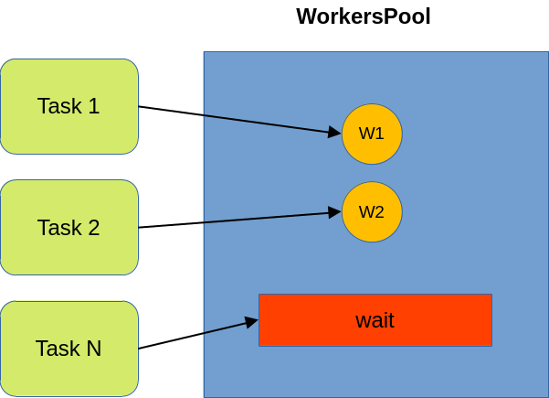

## Golang Concurrency Patterns Examples
This repository contains implemented golang concurrency patterns.

* Generator/Iterator \
Generator pattern is a way to a generate data sequences using paralelism. Using this pattern we are able to make the consumer run in parallel with the generator.

**Implementation**
```go
func generator(buffer ...int) <-chan int {
	// a channel that will be returned with data
	c := make(chan int)
	// parallel process
	go func() {
		// iterate over incomming data chunk
		for item := range buffer {
			// pass data for channel
			c <- item
		}
		// when finnished, close the channel
		close(c)
	}()
	//return the channel
	return c
}
```

**Use**
```go
	// data chunk
	data := []int{1, 2, 3, 4, 5, 6, 7, 8, 9, 0}
	// load data into channel
	g := generator(data...)

	// consum the channel
	for i := range g {
		// print result data chunk
		fmt.Println("item:", i)
	}
```
* Future \
A Future will start a parallel computation, and its results will be available in the future. In golang, a simple goroutine can be use to implement this funcionality, without use of third party libraries or standard ones. 

**Implementation**
```go
func fiboFuture(number int) <-chan int {
	// Channel with the result
	c := make(chan int)

	// Starts a parallel process to calc fibonacci number
	go func() {
		if number <= 1 {
			c <- number
			return
		}

		fib := 1
		prevFib := 1
		for i := 0; i < number; i++ {
			temp := fib
			fib += prevFib
			prevFib = temp
		}
		// Send the result to channel
		c <- fib
		// Close channel
		close(c)
	}()

	return c
}
```

**Use**
```go
	// Gets a future processing
	future := fiboFuture(44)
	// Prints the result of future. If still processing, instead, future will block
	fmt.Println("result of future processing:", <-future)
```

* Fan-in/Fan-out \
The best way to implement a processing pipeline in golang is using the fan in/out pattern. The pattern is built by a function and a goroutine
that transports and loads data, using channels, to another. In the end of process, all the goroutines data are merged into one. Its a way of multiplexing and demultiplexing multiple input data.
See image below:

**Implementation**

<p align="center">
    
</p>

**Use**
```go
	// data to be processed
	data := []int{1, 2, 3, 4, 5}
	// generator loads data
	g := generator(data...)

	// fan-out the data in square pipeline
	sq1 := sq(g)
	sq2 := sq(g)

	// consumn the parallel square pipeline - fan-in
	for item := range merge(sq1, sq2) {
		fmt.Println(item)
	}
```

* WorkersPool \
WorkersPool is a pattern that aims to control the number of goroutines available to a system or application. If we create a pool with 3 workers, than no more goroutines can be spawned to new tasks, and its tasks will be waiting to others finnish.

**Implementation**

<p align="center">
    
</p>

```go
type ExecFunc func()

type ThreadPool struct {
	receiver chan ExecFunc
	size     int
}

func NewThreadPool(size int) *ThreadPool {
	pool := &ThreadPool{
		receiver: make(chan ExecFunc),
		size:     size,
	}

	return pool
}

func (t ThreadPool) start() {
	for i := 0; i < t.size; i++ {
		go func() {
			for {
				f := <-t.receiver
				f()
			}
		}()
	}
}

func (t *ThreadPool) Execute(f ExecFunc) {
	t.receiver <- f
}

```

**Use**
```go
pool := NewThreadPool(3)
var wg sync.WaitGroup
wg.Add(2)
pool.start()

job := func(id int) {
	for i := 0; i < 1000; i++ {
		println(id, "->", i)
	}
}

pool.Execute(func() {
	job(1)
	wg.Done()
})

pool.Execute(func() {
	job(2)
	wg.Done()
})

wg.Wait()
```
